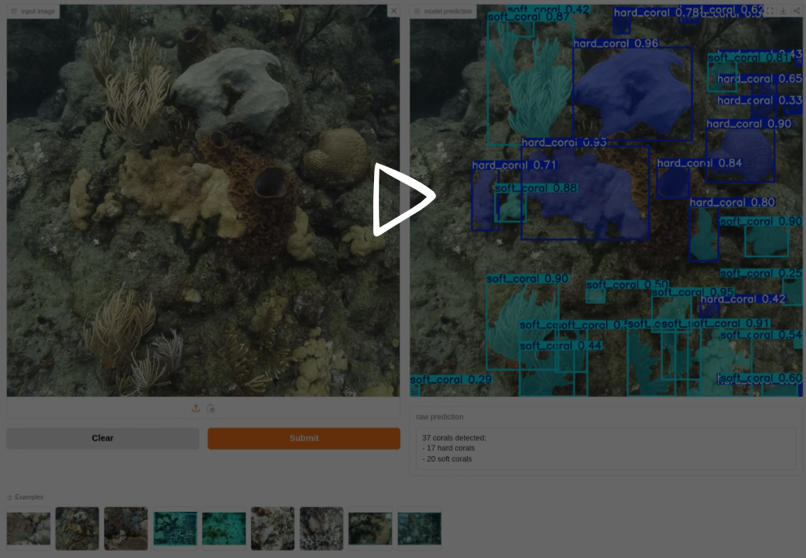
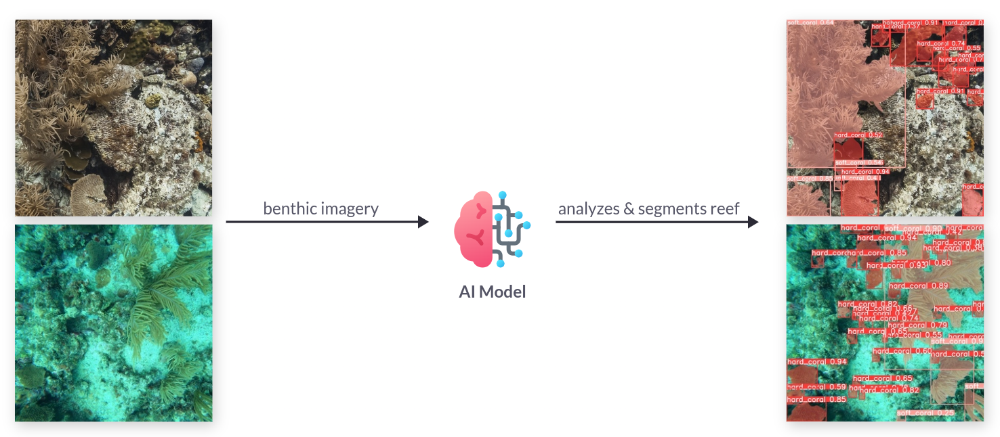
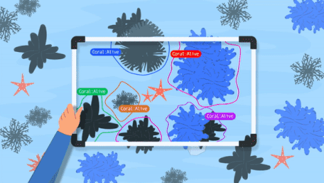

# AI for coral reefs

Segmentation of coral reefs in benthic imagery to quantify the long-term growth
or decline of coral cover within marine protected areas.

[](https://www.earthtoolsmaker.org/spaces/coral_reef_health_monitoring/)

## Context

Marine biologists engaged in the study of coral reefs invest a significant
portion of their time in manually processing data obtained from research dives.
The objective of this collaboration is to create an image segmentation pipeline
that accelerates the analysis of such data. This endeavor aims to assist
conservationists and researchers in enhancing their efforts to protect and
comprehend these vital ocean ecosystems. Leveraging computer vision for the
segmentation of coral reefs in benthic imagery holds the potential to quantify
the long-term growth or decline of coral cover within marine protected areas.



Monitoring coral reefs is fundamental for efficient management, with swift
reporting being critical for timely guidance. Although underwater photography
has significantly enhanced the precision and pace of data gathering, the
bottleneck in reporting results persists due to image processing.



> Our tools tap on AI and computer vision for increasing the capabilities of
> coral reef and marine monitoring in examining benthic/seabed features.
>
> <cite>– ReefSupport</cite>

## Setup

### git-lfs

Make sure [`git-lfs`](https://git-lfs.com/) is installed on your system.

Run the following command to check:

```sh
git lfs install
```

If not installed, one can install it with the following:

#### Linux

```sh
sudo apt install git-lfs
git-lfs install
```

#### Mac

```sh
brew install git-lfs
git-lfs install
```

#### Windows

Download and run the latest [windows installer](https://github.com/git-lfs/git-lfs/releases).


## Fast Track

Create a `virtualenv`, activate it and run the following command that
will do the following: setup the pip dependencies, download the dataset,
process the dataset, finetune the different models, evaluate the models. It
can take a long time. Make sure to use a computer with enough compute
power and a GPU (at least 40GB of memory is currently required).

```sh
make all
```

## Step by step

### Requirements

Create a `virtualenv`, activate it and install the dependencies as follows:

```sh
make setup
```

### Data

Build everything needed by the project. It will take a long
time to download the dataset and preprocess the data.

```sh
make data
```

In the next subsections, we explain how one can run the commands to
donwload the raw data and then process it to prepare it for finetuning.

#### Raw

- [GCP Public bucket](https://console.cloud.google.com/storage/browser/rs_storage_open
)

Download the raw dataset from ReefSupport using the following command:

```sh
make data_download
```

#### Process

One needs to prepare the raw dataset for the models to be trained on.

##### Convert the raw dataset into the [YOLOv8 Pytorch TXT format](https://roboflow.com/formats/yolov8-pytorch-txt)

Run the following command:

```sh
make data_yolov8_pytorch_txt_format
```

##### Generate the mismatch labels

Run the following command:

```sh
make data_mismatch_label
```

##### Prepare the model_inputs

Run the following command:

```sh
make data_model_input
```

_Note_: if one wants to also generate archive files to make it easier to move
around (scp, ssh, etc), just pass the extra `--archive` parameter like so:

```sh
python src/data/yolov8/build_model_input.py \
  --to data/05_model_input/yolov8/ \
  --raw-root-rs-labelled data/01_raw/rs_storage_open/benthic_datasets/mask_labels/rs_labelled \
  --yolov8-pytorch-txt-format-root data/04_feature/yolov8/benthic_datasets/mask_labels/rs_labelled \
  --csv-label-mismatch-file data/04_feature/label_mismatch/data.csv \
  --archive
```

### Training

#### YOLOv8

Make sure there is a GPU available with enough memory ~40GB is required for the
specified batch size.
The model weights and model results are stored in `data/06_models/yolov8/`.

_Note_: use `screen` or `tmux` if you connect to a remote instance with your GPU.

##### All

To finetune all the models with different model sizes, run the following command:

```sh
make finetune_all
```

##### baseline

```sh
make finetune_baseline
```

##### nano

```sh
make finetune_nano
```

##### small

```sh
make finetune_small
```

##### medium

```sh
make finetune_medium
```

##### large

```sh
make finetune_large
```

##### xlarge

```sh
make finetune_xlarge
```

##### Specify your own hyperparameters

To find the list of all possible hyperparameters one can tune, navigate
to the [official YOLOv8
documentation](https://docs.ultralytics.com/modes/train).

```sh
python src/train/yolov8/train.py \
  --experiment-name xlarge_seaflower_bolivar_180_degrees \
  --epochs 42 \
  --imgsz 1024 \
  --degrees 180 \
  --model yolov8x-seg.pt \
  --data data/05_model_input/yolov8/SEAFLOWER_BOLIVAR/data.yaml
```

### Hyperparameters search

Some hyperparameters search was performed to find the best
combination of hyperparameters values for the dataset.
Experiment tracking is done via [wandb](https://wandb.ai/) and one would
need to login into `wandb` with the following command:

```sh
wandb login
```

Paste your wandb API key when prompted.

### Evaluation

#### All models

One can evaluate all the models that were trained and located in the
`data/06_models/yolov8/segment` folder.

```sh
make evaluate_all
```

#### Single model

One can run quantitative and qualitative evaluations using the following command:

```sh
python src/evaluate/yolov8/cli.py \
  --to data/08_reporting/yolov8/evaluation/ \
  --model-root-path data/06_models/yolov8/segment/current_best_xlarge \
  --n-qualitative-samples 10 \
  --batch-size 16 \
  --random-seed 42 \
  --loglevel info 
```

## Inference

### Source: Single image

One can run inference with the following script:

```sh
python src/predict/yolov8/cli.py \
  --model-weights data/06_models/yolov8/segment/current_best_xlarge/weights/best.pt \
  --source-path data/09_external/images/10001026902.jpg \
  --save-path data/07_model_output/yolov8/
```

_Note_: Make sure to use the right model weights path.

### Source: Directory

One can run inference with the following script:

```sh
python src/predict/yolov8/cli.py \
  --model-weights data/06_models/yolov8/segment/current_best_xlarge/weights/best.pt \
  --source-path data/09_external/images/ \
  --save-path data/07_model_output/yolov8/
```

_Note_: Make sure to use the right model-weights path.

### Other sources

YOLOv8 offers a wide variety of source types. The documentation is
available on their [website
here](https://docs.ultralytics.com/modes/predict/#inference-sources).
