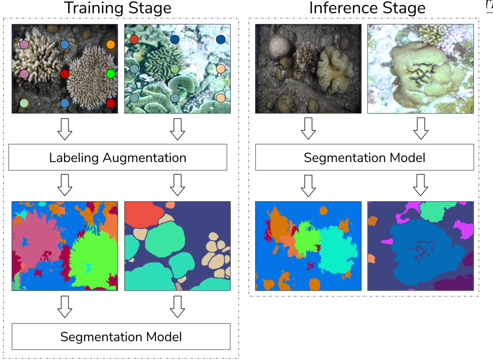

# Knowledge

## Research Papers

### Improved Coral Reef Images Segmentation using Modified JSEG Algorithm

[Link](https://www.researchgate.net/publication/321183563_Improved_Coral_Reef_Images_Segmentation_using_Modified_JSEG_Algorithm)

Unsupervised segmentation. How to apply the JSEG algorithm to underwater
images. Light is absorbed and scattered depending on depth. Water turbicity can
greatly affect image quality.

The  challenge  for  efficient  segmentation  is  even  more difficult because
coral reefs grow in various form of color, texture and shape.

### A New Deep Learning Engine for CoralNet

__CoralNet__: cloud based platform hosted on AWS for manual and semi automatic
analysis of coral reef images. Web base interface or API. Dataset: 1.7M images,
2k surveys. January 2021: CoralNet 1.0, new Machine Learning engine for point
classification.

#### Architecture

Train a backbone network used as a feature extractor (EfficientNet)
Classification heads are fine tuned per survey when users upload new
datapoints.


EfficientNet was selected against ResNet101 to gain speed over accuracy for the
Backbone network.

MLP heads are fine tuned per survey when users add new datapoints (more than
10% datapoints).

### CoralSeg: Learning Coral Segmentation from Sparse Annotations

#### Mini Abstract

In many environmental monitoring instances, such as the coral reef example
studied here, data labeling demands expert knowledge and is costly. Therefore,
many datasets often present scarce and sparse image annotations or remain
untouched in image libraries.
Based on augmenting sparse annotations with the proposed adaptive superpixel
segmentation propagation, we obtain similar results as if training with dense
annotations, significantly reducing the labeling effort. We perform an
in-depth analysis of our labeling augmentation method as well as of different
neural network architectures.

#### Outputs

- New labeled data
- An encoder trained on half a million coral reef images, which is shown to
facilitate the generalization to new coral scenarios.

#### Approach

In the CoralNet1 project, labeled by marine biology experts, each image is only
sparsely labeled, having on average 50-200 labeled pixels.
The idea is to learn dense labeling from sparse labels.

#### Problem formulation

Semantic segmentation when only sparse annotations are available is a very
challenging task.

##### Approach 1

Crop the image into small patches, perform patch classification and then,
stitch these patches back together.
Semantic segmentation can be formulated as a patch classification problem. When
a few annotated pixels are provided, a CNN can be trained on patches cropped
around those labeled pixels to get a final image segmentation joining the
classification result for each patch.

##### Approach 2

Per pixel classification to directly obtain the image semantic segmentation.
More frequently, semantic segmentation is formulated as a pixel classification
problem where the input and output constitute the entire image. In this case,
an end-to-end CNN architecture is trained with dense labels, i.e., fully
labeled images, to obtain the per-pixel classifica- tion directly, i.e., the
semantic segmentation. In our case where only some sparse labels are available,
there are two existing approaches for addressing the sparsity: either propagate
the sparse labels into dense labels, or, train only on the sparse labels and
ignore the non-labeled pixels. We previously showed that the first approach
provides better results as it provides more data for training.



#### Algorithms for extracting superpixels

- Contour Relaxed Superpixels (CRS) [Christian et al., 2013]
- Pseudo-Boolean (PB) [Zhang et al., 2011]
- Entropy Rate Superpixel (ERS) [Liu et al., 2011]
- Simple Linear Iterative Clustering (SLIC) [Achanta et al., 2012]
- Superpixels Extracted via Energy-Driven Sampling (SEEDS) [Van den Bergh et al., 2012]

#### Loss functions

Deep learning architectures for semantic segmentation are commonly optimized
using the __cross-entropy__ loss function. In this paper, a modification of the
cross-entropy loss function taking into account neighboring pixels is
presented.

##### Cross Entropy Loss function

This is the common loss function for classification and semantic segmentation.
This loss optimizes the accuracy per pixel. For classification, this fits
perfectly, but for semantic segmentation, it is applied to every pixel
independently and does not include information about neighboring pixels.

##### Lovasz loss function

It optimizes the MIoU Mean Intersection over Union - Standard metric for
semantic segmentation.

##### Cross Entropy Loss function with median frequency balancing

Modification of the cross entropy loss function that adds weights to every
semantic class to optimize the mean accuracy per class, reducing the effect of
class imbalance.

##### Proposed loss function

A modification of the cross-entropy loss function to take into account the
prediction of neighboring pixels without adding much computation. In most
semantic segmentation use cases, if one pixel belongs to a certain class, its
neighbors (at different distances) are likely to belong to the same class.
Thus, following this intuition, we give more importance (higher loss) to pixels
whose neighboring pixel predictions are not the same (we consider the pixel
connectivity as 4-neighbor, i.e. 4-connectivity).

- The loss will prevent the algorithm from predicting isolated pixels, i.e.,
pixels of the same type are usually together. This will help the overall
accuracy and MIoU performance.
- The classes with less data will have fewer neighbors of their type;
therefore, these classes will have a higher impact on the loss, correcting the
class imbalance.

#### Augmentation methods

vertical and horizontal flips, contrast normalization,
and random image shifts and rotations

### Per-Pixel Classification is Not All You Need for Semantic Segmentation - MaskFormer

- [Github Project](https://bowenc0221.github.io/maskformer)

#### Mini Abstract

Commonly, semantic segmentation is formulated as a per pixel classification
tasks. Instance level segmentation is handled with mask classification.
__key insight__: mask classification is sufficiently general to solve both
semantic and instance-level segmentation tasks in a unified manner using the
exact same model, loss, and training procedure.

Can a single mask classification model simplify the landscape of effective
approaches to semantic- and instance-level segmentation tasks? And can such a
mask classification model outperform existing per-pixel classification methods
for semantic segmentation?


## Last challenge - 2021

### Classification

The goal of this subgroup was to automate the classification of image content.
Here specifically, images contained a range of static benthic organisms such as
hard coral, algae and bare substrate that are commonly found on tropical coral
reefs. Ideally, the final model would accurately differentiate between at least
coral (hard and soft) and non-coral objects, or eventually among a group of
several biologically functional entities. The final model should further be
able to classify chosen groups with an accuracy >75% and should be presented
including measures of additional evaluation against ground truth information.
An extra goal was to obtain an estimation of coral coverage of the terrain
based on the model’s predictions.

#### Resources

- [Final Presentation](https://docs.google.com/presentation/d/1zCBW0gCXzGxFRdDS47lZVljIBtMzow8h/edit#slide=id.p1)
- [Litterature - The Catlin Seaview Survey](https://onlinelibrary.wiley.com/doi/10.1002/aqc.2505)
- [Litterature - The Catlin Seaview Survey](https://onlinelibrary.wiley.com/doi/10.1002/aqc.2505)
- [Seaview Survey Photo-quadrat and Image Classification Dataset](https://espace.library.uq.edu.au/view/UQ:734799)

#### Problems & Recommendations

Multiscale input or alternative superpixel approaches
Highly unbalanced dataset

### Segmentation

#### Resources

- [Final Report](https://docs.google.com/document/d/1OiVPgwpZowYKSRY0GyjWE0B1OvlJgFl1/edit)
- [Final Presentation](https://docs.google.com/presentation/d/1q94VxHOr7Jop_9liQ-64lEeABwPqxf0ei9gqxMd7gR0/edit#slide=id.g10727107231_0_256)

#### Modelling

This algorithm uses k-mean clustering, an unsupervised classification
technique. SLIC divides the image into a given number of clusters (i.e.,
superpixels) based on their RGB values and proximity. Next, the full image is
broken down into smaller regions of 224 x 224 pixels centered on each cluster
centroid.  Each sub-image is then passed to the GoogLeNet classifier to produce
a label.

Then, the labels of the clusters are inferred - we assume that the whole
cluster represents the same class as its centroid.

#### Evaluation Metric

Evaluating our algorithm explicitly is difficult because there is no ground
truth image-level data. The accuracy will likely depend strongly on the
accuracy of the classifier, as well as the extent to which each subimage
contains only a single function group.

#### Problems

##### Team / People

Lots of people simply disappeared after a while. Only two people remained at
the end.

##### Data

Annotations are sparse: Each image contained about 1 million pixels, but only
50 - 200 were labelled. The pixel variability, whether noise or real,
ultimately made it difficult to train an accurate model to classify the
remaining pixels. This is a common problem in computer vision, and there exists
a tool called ML-Superpixels to produce dense labels from sparse labels.
However, we were not able to configure the software to run.

## SLIC

This algorithm uses k-mean clustering, an unsupervised classification
technique. SLIC divides the image into a given number of clusters (i.e.,
superpixels) based on their RGB values and proximity. Next, the full image is
broken down into smaller regions of 224 x 224 pixels centered on each cluster
centroid.  Each sub-image is then passed to the GoogLeNet classifier to produce
a label.

Then, the labels of the clusters are inferred - we assume that the whole
cluster represents the same class as its centroid.

## Mask RCNN

### Architecture


## Segmentation tasks

Segmentation refers to the task of segregating objects in a complex visual
environment and is an important area of computer vision research.


### Instance segmentation

Instance Segmentation is a special form of image segmentation that deals with
detecting instances of objects and demarcating their boundaries. Instance
Segmentation is the technique of detecting, segmenting, and classifying every
individual object in an image. Multiple cats, dogs, corals can be in the same
picture. It treats multiple objects of the same class as distinct instances.

### Semantic segmentation

A semantic segmentation framework produces pixel-level category labels for each
category class. It does not find different instances/objects but it works at
the pixel level. Thus all instances of a particular category receive the same
label.

### Panoptic segmentation

Panoptic segmentation uses an algorithm to understand the difference between
amorphous stuff and countable things like cars and persons.

In computer vision, the task of panoptic segmentation can be broken down into
three simple steps:
1. Separating each object in the image into individual parts, which are
   independent of each other.
2. Painting each separated part with a different color—labeling.
3. Classifying the objects.

Panoptic segmentation is a hybrid method combining semantic segmentation and
instance segmentation.

### Object detection

Object detection system coarsely localizes multiple objects with bounding boxes.

### Vocabulary

- __Superpixel__: a cluster of connected image pixels - components
- __Stuff__: defines categories, which cannot be counted such as the sky and
the road.
- __Things__: are the actual objects in the image—they can be counted by
assigning different instance IDs to each one of them.

### Common metrics

- __PA__: pixel accuracy
- __MPA__: mean pixel accuracy (per class)
- __MIoU__: mean intersection over union

#### Object Detection Metrics

- __Intersection over Union (IoU)__: IoU is a measure that quantifies the overlap between a predicted bounding box and a ground truth bounding box. It plays a fundamental role in evaluating the accuracy of object localization.
- __Average Precision (AP)__: AP computes the area under the precision-recall curve, providing a single value that encapsulates the model's precision and recall performance.
- __Mean Average Precision (mAP)__: mAP extends the concept of AP by calculating the average AP values across multiple object classes. This is useful in multi-class object detection scenarios to provide a comprehensive evaluation of the model's performance.
- __Precision and Recall__: Precision quantifies the proportion of true positives among all positive predictions, assessing the model's capability to avoid false positives. On the other hand, Recall calculates the proportion of true positives among all actual positives, measuring the model's ability to detect all instances of a class.
- __F1 Score__: The F1 Score is the harmonic mean of precision and recall, providing a balanced assessment of a model's performance while considering both false positives and false negatives.


### YOLOv8

- [Github](https://github.com/ultralytics/ultralytics)
- [Tutorial for fine tuning YOLOv8 on custom dataset](https://blog.roboflow.com/how-to-train-yolov8-instance-segmentation/)
* [YOLOv8 training guide](https://www.ikomia.ai/blog/train-yolov8-custom-dataset)

#### Interpreting Metrics

[Reference](https://docs.ultralytics.com/guides/yolo-performance-metrics/#how-to-calculate-metrics-for-yolov8-model)

One of the sections of the output is the class-wise breakdown of performance metrics. This granular information is useful when you are trying to understand how well the model is doing for each specific class, especially in datasets with a diverse range of object categories. For each class in the dataset the following is provided:

- __Class__: This denotes the name of the object class, such as "person", "car", or "dog".
- __Images__: This metric tells you the number of images in the validation set that contain the object class.
- __Instances__: This provides the count of how many times the class appears across all images in the validation set.
- __Box(P, R, mAP50, mAP50-95)__: This metric provides insights into the model's performance in detecting objects:
  - __P (Precision)__: The accuracy of the detected objects, indicating how many detections were correct.
  - __R (Recall)__: The ability of the model to identify all instances of objects in the images.
  - __mAP50__: Mean average precision calculated at an intersection over union (IoU) threshold of 0.50. It's a measure of the model's accuracy considering only the "easy" detections.
  - __mAP50-95__: The average of the mean average precision calculated at varying IoU thresholds, ranging from 0.50 to 0.95. It gives a comprehensive view of the model's performance across different levels of detection difficulty.

#### Choosing the Right Metrics

Choosing the right metrics to evaluate often depends on the specific application.
- __mAP__: Suitable for a broad assessment of model performance.
- __IoU__: Essential when precise object location is crucial.
- __Precision__: Important when minimizing false detections is a priority.
- __Recall__: Vital when it's important to detect every instance of an object.
- __F1 Score__: Useful when a balance between precision and recall is needed.

For real-time applications, speed metrics like FPS (Frames Per Second) and latency are crucial to ensure timely results.

#### Interpretation of Results

It’s important to understand the metrics. Here's what some of the commonly observed lower scores might suggest:

- __Low mAP__: Indicates the model may need general refinements.
- __Low IoU__: The model might be struggling to pinpoint objects accurately. Different bounding box methods could help.
- __Low Precision__: The model may be detecting too many non-existent objects. Adjusting confidence thresholds might reduce this.
- __Low Recall__: The model could be missing real objects. Improving feature extraction or using more data might help.
- __Imbalanced F1 Score__: There's a disparity between precision and recall.
- __Class-specific AP__: Low scores here can highlight classes the model struggles with.

### COCO annotation format

- [Create COCO annotation from scratch](https://www.immersivelimit.com/tutorials/create-coco-annotations-from-scratch)
- [Script that turns an image into a COCO annotation](https://github.com/chrise96/image-to-coco-json-converter)

### Resources

- [Segmentation Guide](https://www.v7labs.com/blog/instance-segmentation-guide)
- [Panoptic Segmentation Guide](https://www.v7labs.com/blog/panoptic-segmentation-guide)
- [Instance segmentation guide](https://engineering.matterport.com/splash-of-color-instance-segmentation-with-mask-r-cnn-and-tensorflow-7c761e238b46)

## Tooling

### lab.fruitpunch.ai

A GPU server can be provided by fruitpunch, an SSH password will be shared.
One needs to access the GPU box throuh a bastion.

#### Copy data into the GPU box

```sh
scp -o ProxyCommand="ssh participant@lab.fruitpunch.ai  nc localhost 10022" archive_* participant@localhost:/data/ai-for-coral-reefs-2/yolov8_ready/benthic_datasets/
```

#### Get the data from the GPU box

```sh
scp -o ProxyCommand="ssh participant@lab.fruitpunch.ai  nc localhost 10022" participant@localhost:/data/ai-for-coral-reefs-2/test2.txt .
```
