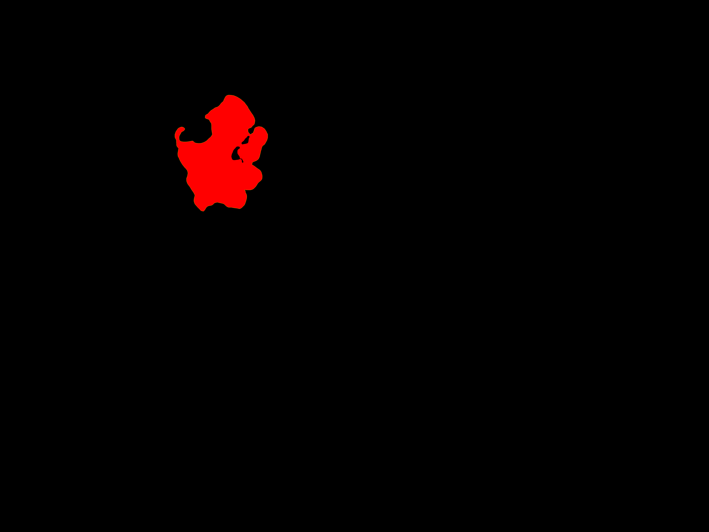
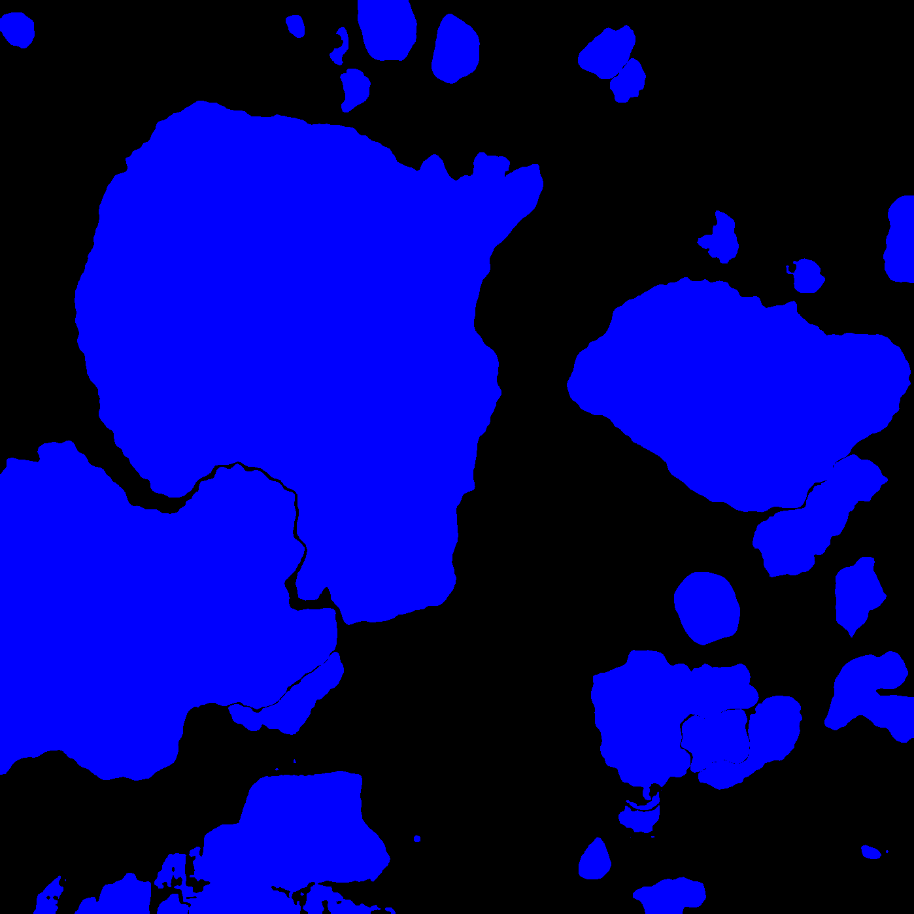
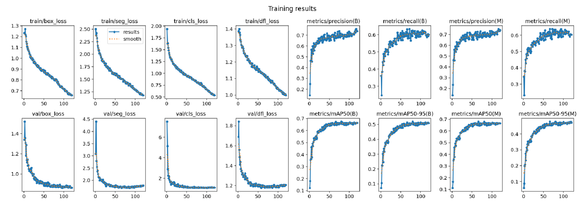

## Intro

Marine biologists engaged in the study of coral reefs invest a significant
portion of their time in manually processing data obtained from research dives.
The objective of this challenge is to create an image segmentation pipeline
that accelerates the analysis of such data. This endeavor aims to assist
conservationists and researchers in enhancing their efforts to protect and
comprehend these vital ocean ecosystems. Leveraging computer vision for the
segmentation of coral reefs in benthic imagery holds the potential to quantify
the long-term growth or decline of coral cover within marine protected areas.

## The challenge

The primary objective of this subgroup is to automate the image segmentation
process for underwater imagery. The dataset provided encompasses a diverse
collection of static benthic organisms, including coral, algae, and bare
substrate commonly found in tropical coral reefs. The ultimate goal for the
final model is to accurately distinguish between hard and soft corals, with the
eventual capability to identify various biologically functional entities.

A crucial application for the developed model lies in estimating the benthic
coverage of coral groups.

Initially, 30 participants joined the challenge and were organized into
different subgroups based on their personal interests. Each subgroup is tasked
with employing a specific modeling approach to address the segmentation
problem. The challenge concludes with a comprehensive comparison of results,
and ReefSupport aims to identify the most suitable approach for their specific
use cases.

This report provides a comprehensive summary of the efforts invested in
developing the YOLOv8 model approach.
imagery.

## Computer Vision for underwater imagery

Computer vision tasks in underwater imagery pose unique challenges that make
them particularly difficult. Here are some key reasons:

1. __Limited Light and Color Variation:__ Underwater environments typically
   have limited light penetration, leading to reduced visibility and color
distortion. The attenuation of light in water results in diminished contrast
and color richness, making it challenging for computer vision models to
accurately perceive and differentiate objects.

2. __Scattering and Absorption:__ Water causes scattering and absorption of
   light, which can obscure details and create hazy or blurry images. This
phenomenon is exacerbated as the distance from the camera increases, impacting
the clarity of objects in the scene. The scattering of light can also cause
objects to appear larger or closer than they are.

3. __Complex Backgrounds:__ Underwater scenes often feature intricate and
   dynamic backgrounds, such as coral reefs, plants, and marine life. The
complexity of these backgrounds can make it challenging for computer vision
models to distinguish between the objects of interest and the surrounding
environment.

4. __Limited Annotated Data:__ Annotating underwater imagery for training
   machine learning models is a labor-intensive process. The scarcity of large
and well-annotated datasets specific to underwater scenes makes it difficult to
train models effectively. Limited training data can lead to challenges in
achieving robust generalization.

5. __Distinctive Visual Artifacts:__ Underwater imagery may exhibit visual
   artifacts such as caustics, backscatter, and particulate matter in the
water. These artifacts can introduce noise and irregularities, impacting the
performance of computer vision algorithms.

6. __Variable Environmental Conditions:__ Underwater conditions are highly
   variable, including changes in water clarity, currents, and turbulence.
These variations can affect the quality and consistency of images, making it
difficult for models trained on one set of conditions to generalize well across
different scenarios.

7. __Lack of Standardization:__ Unlike many computer vision tasks on land,
   there is less standardization in underwater imaging equipment and
techniques. Different cameras, lighting setups, and environmental conditions
can lead to a wide range of image characteristics, complicating the development
of universally applicable models.

Addressing these challenges in underwater computer vision requires specialized
techniques, data augmentation strategies, and innovative algorithms tailored to
the unique characteristics of underwater imagery. Advances in this field have
the potential to contribute significantly to marine biology, environmental
monitoring, and underwater exploration.

## YOLOv8

__YOLOv8__ (You Only Look Once version 8) is originally an object detection
model used in computer vision. YOLOv8 is part of the YOLO series (You Only Look
Once), which is known for its real-time object detection capabilities.

Key features of YOLOv8 include:

- __One-stage Detection__: YOLO operates as a one-stage object detection
   model, as opposed to two-stage models like Faster R-CNN. It processes the
entire image in a single forward pass to detect objects, making it faster.
- __Real-time Processing__: YOLO models are designed for real-time object
   detection, making them suitable for applications like video surveillance,
autonomous vehicles, and robotics.
- __Accuracy and Speed Tradeoff__: YOLOv8 aims to strike a balance between
   accuracy and speed. It may sacrifice some precision compared to slower
models, but it excels in processing speed.

As for the specific computer vision tasks it can perform, YOLOv8 is primarily
used for object detection but can be used for instance segmentation and key
pose recognition too. Some common applications include:

- __Object Recognition__: Identifying and classifying objects within an image
or video feed.
- __Real-time Surveillance__: Monitoring live video streams for security
purposes, detecting and tracking objects or people.
- __Autonomous Vehicles__: YOLOv8 can be utilized for detecting and tracking
objects in the environment, which is crucial for the operation of autonomous
vehicles.
- __Human Pose Estimation__: Detecting and estimating the pose of human bodies
in images or videos.
- __General Object Tracking__: Tracking the movement of objects over
consecutive frames in a video.

| YOLOv8 Architecture |
|:-------------------:|
| { width=500px } |

\newpage

## Data

The data provided by ReefSupport is made available on a publically hosted [Google
Cloud bucket](https://console.cloud.google.com/storage/browser/rs_storage_open).
Two types of datasets are available:

- __Point labels or sparse labels__: random points in an image are classified. A
typical image would contain between 50 and 100 point labels.
- __Mask labels or dense labels__: detailed segmentations masks are provided for
hard and soft corals. Two datasets are provided (ReefSupport and CoralSeg).

Given the nature of the computer vision task, dense labels are required. YOLOv8
cannot be trained on semantic segmentation but only on instance segmentation.
Therefore, individual masks for each coral instance are required. We decided to
not use CoralSeg as it does not provide the individual masks and because the
data quality and quantity of the ReefSupport dataset seemed enough for the task
at hand.

The ReefSupport dataset provides high quality dense labels using images
from the `SEAVIEW`, `TETES` and `SEAFLOWER` datasets. Samples of images from
these regions were fully annotated with individual masks for each instance.

 Sample | Sample | Sample | Sample |
:------:|:------:|:------:|:------:|
{ height=120px } | { height=120px } | { height=120px } | { height=120px }
{ height=120px } | { height=120px } | { height=120px } | { height=120px }

Each image is associated with a stitched dense mask and all its individual mask instances.

 Image | Dense Mask | Individual Mask | Individual Mask | Individual Mask |
:------:|:------:|:------:|:------:|:------:|
{ width=120px } | { width=120px } | { width=120px } | { width=120px } | { width=120px }

\newpage

The datapoints are distributed among the different regions as summarized in the
table below:

| Dataset   | Region      | # dense labels | # usable dense labels | Reasons         |
|:---------:|:-----------:|:----------------------:|:-----------------------------:|:---------------:|
| SEAFLOWER | BOLIVAR     | 246                    | 245                           | labels mismatch |
| SEAFLOWER | COURTOWN    | 241                    | 241                           |                 |
| SEAVIEW   | ATL         | 705                    | __330__                       | empty masks + labels_mismatch |
| SEAVIEW   | IDN_PHL     | 466                    | __237__                       | empty masks + labels mismatch |
| SEAVIEW   | PAC_AUS     | 808                    | __584__                       | empty masks + labels mismatch |
| SEAVIEW   | PAC_USA     | 728                    | __0__                         | low quality labelling |
| TETES     | PROVIDENCIA | 105                    | ___105___                     | data leakage    |
| ALL       | ALL         | __3299__               | __1742__                      |                 |

About only half of the provided datapoints are usable for training due to data
issues or specificities. They are discussed in the following next sections.

### Data imbalance

In the overall dataset, instances of hard coral outnumber instances of soft
coral by a factor of five. This notable disparity raises the potential for
modeling challenges, necessitating careful consideration and appropriate
adjustments to address the imbalance.

| Label Distribution | Pixel Class Distribution by region |
|:------------------:|:----------------------------------:|
| { width=200px } | { width=400px }

__Suggestion__: Ensure that the data imbalance does not adversely affect the
model's performance. In case of any observed impact, consider implementing a
strategic approach such as oversampling, downsampling, or utilizing a weighted
loss function to appropriately address and mitigate the effects of the
imbalance.

### Low dense labels quality for `SEAVIEW_PAC_USA`

The presence of dense labels in `SEAVIEW/PAC_USA` has introduced challenges in
the data modeling process, necessitating their exclusion from the training set.
Regrettably, the labeling process for this dataset involved creating extensive
masks that covered almost all corals within an image, rather than generating
individual masks for each distinct entity.

| Image     | GT Mask | Image     | GT Mask | Image     | GT Mask |
|:---------:|:-------:|:---------:|:-------:|:---------:|:-------:|
| { width=90px } | { width=90px } | { width=90px } | { width=90px } | { width=90px } | { width=90px } |

__Suggestion__: Revisit the labeling process for the `SEAVIEW_PAC_USA` region,
ensuring that comprehensive guidelines are provided to labelers. This step aims
to enhance the accuracy and specificity of the labeling, thereby optimizing the
quality of the dataset for improved model training.

### Image size and quality

The images sourced from `SEAFLOWER_BOLIVAR`, `SEAFLOWER_COURTOWN`, and
`TETES_PROVIDENCIA` exhibit significantly larger dimensions, containing 5-10
times more pixels compared to those from SEAVIEW. While this size difference
doesn't pose an immediate concern during the data modeling stage, it could
potentially impact the model evaluation process.

Specifically, when assessing metrics at the pixel level, such as confusion
matrices, mIoU, and Dice scores, the varying image sizes may introduce bias. If
the model performs exceptionally well on the larger images from these three
regions, the results may be disproportionately influenced by the sheer number
of pixels present. To mitigate this potential issue, consideration should be
given to resizing the images during the evaluation phase.

| Image from SEAFLOWER_BOLIVAR (4.70MB) | Image from SEAVIEW_ATL (0.68MB) |
|:------------------------------------:|:------------------------------:|
| { height=150px } | { height=150px } |

__Suggestion__: Conduct a comprehensive evaluation of the models on each region
to obtain a precise understanding of their actual performance and
generalization capabilities. This approach ensures a nuanced assessment that
accounts for potential variations across different regions, contributing to a
more accurate interpretation of the models' effectiveness.

### Empty masks

Empty stitched masks, characterized by entirely black pixels, were identified
within the datasets. Subsequent removal of these empty masks resulted in
improved overall performance. Notably, there were 532 empty masks identified in
`SEAVIEW_PAC_USA` and 328 in `SEAVIEW_ATL`. The elimination of such empty masks
contributes to a more refined dataset, enhancing the model's efficiency and
accuracy during training and evaluation.

| Image     | GT Mask | Image     | GT Mask | Image     | GT Mask |
|:---------:|:-------:|:---------:|:-------:|:---------:|:-------:|
| { width=90px } | { width=90px } | { width=90px } | { width=90px } | { width=90px } | { width=90px } | 

__Suggestion__: Address the export script from Labelbox to ensure the exclusion
of empty masks. It is noteworthy that ReefSupport successfully implemented this
fix during the course of the challenge. Confirming and maintaining this
adjustment in the export script will contribute to the ongoing improvement of
data quality and model training.

### Mismatched sparse and dense labels

The unsupervised group conducted an exploratory analysis to contrast sparse and
dense labels. Specifically, they juxtaposed the dense labels provided by
ReefSupport with the point labels available for the corresponding images.

#### Issue Overview

The dense masks supplied in the `reef_support` folder for the `Seaview dataset`
exhibit discrepancies when compared to the point labels provided in the
`Seaview dataset`. It is crucial to assess the extent of these mismatches and
determine the feasibility of using the reef_support masks in conjunction with
the `Seaview Point Labels` dataset.

For instance, a 1024x1024 dense mask contains labels for one million pixels,
whereas the corresponding point labels for the same image only cover 50-300
points. Despite the random selection of points in the point labels, a
comprehensive comparison can still unveil potential contradictions in the
annotations.

#### Extent of mismatch

| Number of mismatch points within an image | number of images |
|:-----------------------------------------:|:----------------:|
| No mismatch                               | 303              |
| 1-10%                                     | 1048             |
| 11-25%                                    | 744              |
| 26-50%                                    | 418              |
| 51-75%                                    | 128              |
| 76-100%                                   | 66               |

{ width=300px }

The presented samples illustrate instances where point labels contradict dense
labels. Each white cross signifies a label mismatch, with the first sample
showing a 17% error mismatch and the last sample demonstrating a complete 100%
error mismatch.

| Label Mismatch |
|:--------------:|
| { width=400px } |
| { width=400px } |
| { width=400px } |
| { width=400px } |

Out of the 2707 dense masks, only 303 exhibit complete agreement (100%) with
Seaview Point Labels. The remaining images display mismatches ranging from 1%
to 100%. It's important to note that these mismatches are measured in terms of
point labels, not in relation to the impacted area in the dense masks.

#### Handling

A total of 1504 dense labels exhibited more than 10 mismatched label points,
leading to their exclusion from both the training and evaluation sets. This
corresponds to a sparse labels error rate of 10%, considering 100 points, and a
20% sparse labels error rate with 50 points.

The decision was made to exclude these dense labels from both the training and
evaluation sets to ensure the integrity and accuracy of the dataset.

### Data Leakage

The `TETES_PROVIDENCIA` region has been identified with data leakage, wherein
it includes overlapping images of the same quadrats. This presents a challenge
as these images can be inadvertently distributed across different sets, such as
train, validation, or test. The consequence of this is a potential
overinflation of reported performance metrics during evaluations on the test
and validation sets.

Analyzing the sequential order of image IDs reveals a notable trend, indicating
that the majority of images exhibit overlap with their neighboring
counterparts.

| Image 1 | Image 2 | Image 3 | Image 4 |
|:-------:|:-------:|:-------:|:-------:|
| { width=150px } | { width=150px } | { width=150px } | { width=150px } |
| { width=150px } | { width=150px } | { width=150px } | { width=150px } |

__Suggestion:__ To address the issue of overlapping quadrat images, consider
either removing them from the dataset or providing a metadata file that clearly
specifies which images should be grouped together. This proactive measure
ensures that such images are consistently assigned to the same set, preventing
unintentional distribution across different sets.

__Note:__ It is essential to acknowledge that the identification of this data
leakage occurred late in the challenge, after the YOLOv8 models had already
been trained on the full dataset. This issue significantly influences the
overall model performance. In this report, the extent of the data leakage is
assessed by examining region-level performances.

\newpage

## Data Preprocessing

### PyTorch YOLOv8 TXT format

To leverage the YOLOv8 ecosystem, it is imperative to preprocess the raw
datasets provided into a format that is compatible with the model's
requirements.

The training script mandates a specific folder structure, outlined as follows:

```sh
data.yaml
|-- train
|   |-- images
|   |-- labels
|-- val
    |-- images
    |-- labels
```

The `data.yaml` file looks like the following:

```yaml
train: ./train/images
val: ./val/images
nc: 2
names:
  - hard_coral
  - soft_coral
```

Each label file in `train/labels` and `val/labels` is a filename with the same
name as its associated image.

Each line represents an instance of a class with a defined contour. It has the
following format:

```txt
class_number x1 y1 x2 y2 x3 y3 ... xk yk
class_number x1 y1 x2 y2 x3 y3 ... xj yj
```

Where the coordinates `x` and `y` are normalized to the image width and height
accordingly. Therefore, they always lie in the range `[0,1]`.

Example:

```txt
1 0.617 0.359 0.114 0.173 0.322 0.654
0 0.094 0.386 0.156 0.236 0.875 0.134
```

Therefore, each line corresponds to an individual mask instance.

### Train/val/test split methodology

In this section, we elucidate the methodology employed for the train/val/test
splits across different datasets.

For each region, a dedicated dataset is created with an `80/10/10` split ratio
for train/val/test. Simultaneously, a comprehensive global dataset is
established using the same split ratios. Importantly, any image allocated to
the test set for a region-specific dataset is also included in the test set for
the global dataset (similarly for train and val splits). This design
facilitates the evaluation of models trained on region-specific datasets
against the global dataset.

It is worth noting that the `SEAVIEW_PAC_USA` data is excluded from these
splits due to identified labeling issues, as detailed in the Data section
above.

| Dataset   | Region      | splits ratio | train | val  | test | total |
|-----------|-------------|--------------|-------|------|------|-------|
| ALL       | ALL         | 80/10/10     | 1392  | 173  | 177  | 1742  |
| SEAFLOWER | BOLIVAR     | 80/10/10     | 196   | 24   | 25   | 245   |
| SEAFLOWER | COURTOWN    | 80/10/10     | 192   | 24   | 25   | 241   |
| SEAVIEW   | ATL         | 80/10/10     | 264   | 33   | 33   | 330   |
| SEAVIEW   | IDN_PHL     | 80/10/10     | 189   | 24   | 24   | 237   |
| SEAVIEW   | PAC_AUS     | 80/10/10     | 467   | 58   | 59   | 584   |
| TETES     | PROVIDENCIA | 80/10/10     | 84    | 10   | 11   | 105   |

Each dataset comes with a `config.yaml` file that summarizes which
files are included in the set and which random seed was used.

Here is the `config.yaml` for the `TETES_PROVIDENCIA` region.

```yaml
# TETES_PROVIDENCIA dataset
dataset_names:
  - TETES_PROVIDENCIA
seed: 42
train_size_ratio: 0.8
val_test_size_ratio: 0.5
train_dataset_size: 84
val_dataset_size: 10
test_dataset_size: 11
train_dataset:
  TETES_PROVIDENCIA:
    - G0088461.JPG
    - G0088475.JPG
    - ...
val_dataset:
  TETES_PROVIDENCIA:
    - G0088488.JPG
    - ...
test_dataset:
  TETES_PROVIDENCIA:
    - G0088440.JPG
    - ...
```

Here is the `config.yaml` for the global dataset:

```yaml
# ALL dataset config.yaml
dataset_names:
  - SEAFLOWER_BOLIVAR
  - SEAFLOWER_COURTOWN
  - SEAVIEW_ATL
  - SEAVIEW_IDN_PHL
  - SEAVIEW_PAC_AUS
  - TETES_PROVIDENCIA
seed: 42
train_size_ratio: 0.8
val_test_size_ratio: 0.5
train_dataset_size: 1392
val_dataset_size: 173
test_dataset_size: 177
train_dataset:
  SEAFLOWER_BOLIVAR:
    - 20220913_AnB_CB12 (21).JPG
    - 20220912_AnB_CB10 (49).JPG
    - ...
  SEAFLOWER_COURTOWN:
    - E9_T1_C6_Corr_26sep22_.jpg
    - E2_T2_C7_Corr_23sep22.jpg
    - ...
  SEAVIEW_ATL:
    - 20020043701.jpg
    - 20015175202.jpg
    - ...
val_dataset:
  SEAFLOWER_BOLIVAR:
    - 20220913_AnB_CB11 (495).JPG
    - ...
test_dataset:
  SEAFLOWER_BOLIVAR:
    - 20220912_AnB_CB10 (156).JPG
    - ...
```

\newpage

## Data Modeling

### Evaluation Metrics and Evaluation Script

The __mean Intersection Over Union__ (mIoU) and the __Dice Coefficient__ were selected to
evaluate the performance of the semantic segmentation results from the models.
We stayed away from mean Precision Accuracy (mPA) as it can be very problematic
in skewed datasets.

#### IoU or Jaccard Index

In the context of semantic segmentation, the Jaccard Index is often referred to
as the Intersection over Union (IoU) or the Jaccard similarity coefficient. It
is a metric used to assess the accuracy of segmentation models by measuring the
overlap between the predicted segmentation masks and the ground truth masks.

$$IoU = \dfrac{A \cap B}{A \cup B}$$

The intersection is the number of pixels that are correctly predicted as part
of the object, and the union is the total number of pixels predicted as part of
the object by the model, including both true positives and false positives.

Higher Jaccard Index values imply better segmentation accuracy, indicating a
greater overlap between the predicted and ground truth regions.

The Jaccard Index is commonly used as an evaluation metric for semantic
segmentation models. Alongside metrics like pixel accuracy and class-wise
accuracy, the Jaccard Index helps quantify the spatial agreement between the
predicted and ground truth segmentation masks.

#### Dice Coefficient or F1 score

The Dice coefficient, also known as the Dice similarity coefficient or Dice
score, is a metric commonly used in semantic segmentation to quantify the
similarity between the predicted segmentation mask and the ground truth mask.
It is particularly useful for evaluating the performance of segmentation
models, especially when dealing with imbalanced datasets.

The Dice coefficient is calculated using the following formula:

$$DiceCoefficient = \dfrac{2 \times TP}{2 \times TP + FP + FN}$$

Here's how the terms are defined:

- __True Positives (TP)__: The number of pixels that are correctly predicted as
part of the object by both the model and the ground truth. In segmentation, a
true positive occurs when a pixel is correctly identified as belonging to the
object.

- __False Positives (FP)__: The number of pixels that are predicted by the
model as part of the object but are actually part of the background according
to the ground truth.

- __False Negatives (FN)__: The number of pixels that are part of the object in
the ground truth but are incorrectly predicted as background by the model.

The Dice coefficient essentially measures how well the model captures the true
positives relative to the total pixels predicted as part of the object (both
true positives and false positives) and the total pixels that actually belong
to the object (true positives and false negatives). The factor of 2 in the
numerator and denominator is used to ensure that the Dice coefficient ranges
from 0 to 1.

A high Dice coefficient indicates a strong agreement between the predicted
segmentation and the ground truth, while a low Dice coefficient suggests poor
segmentation performance.

In summary, the Dice coefficient provides a way to balance and evaluate the
trade-off between precision (capturing true positives) and recall (capturing
all actual positives) in semantic segmentation tasks. It is a valuable metric,
especially in cases of class imbalance where accuracy alone may not provide a
clear picture of the model's performance.

#### YOLOv8 specifics

YOLOv8 cannot be directly trained for semantic segmentation. It can be
trained to perform instance segmentation which localizes and segments the
different instances of soft and hard corals in the image - which is a much
harder task than semantic segmentation. If it can be trained to perform
instance segmentation well on the provided dataset, it is possible to derive
semantic segmentation masks.

As a result, YOLOv8 provides extra information such as localization bounding
boxes which can be used to count instances in an image compared to a
model that would only perform semantic segmentation.

Being able to run the same evaluation script on the same test set for different
model types (YOLOv8, SAM, LabelPropagator and MaskRCNN) is critical to compare
them.

### Baseline

A __baseline__ model was swiftly established to gauge the effectiveness of our
approach and assess the potential performance enhancements that could be
achieved.

| Hyperparameter Name | Hyperparameter Value    |
|---------------------|-------------------------|
| Model Size          | m                       |
| data                | All regions             |
| epochs              | 5                       |
| imgsz               | 640                     |
| close_mosaic        | 10                      |
| degrees             | 0                       |
| flipud              | 0                       |
| translate           | 0.1                     |

| Training Results | Confusion Matrix |
|:----------------:|:----------------:|
{ width=400px } | { width=250px } |

| mIoU | IoU_hard | IoU_soft | IoU_other | mDice | Dice_hard | Dice_soft | Dice_other |
| ---- | ---------| -------- | --------- | ----- | --------- | --------- | ---------- |
| __0.70__ | 0.64     | 0.58     | 0.89      | 0.82  | 0.78      | 0.73      | 0.94       |

| Image | Ground Truth | Prediction |
:------:|:------------:|:----------:|
| { width=150px } | { width=150px } | { width=150px } |
| { width=150px } | { width=150px } | { width=150px } |
| { width=150px } | { width=150px } | { width=150px } |

The baseline model has already demonstrated a commendable performance with a
high __mIoU__ (0.70) and the capability to generate satisfactory segmentation
masks, as illustrated in the random samples above. There is potential for
further improvement by fine-tuning hyperparameters to enhance its overall
effectiveness.

### Best models

In this section, we showcase the optimal models achieved through extensive
fine-tuning efforts, involving hundreds of hours of GPU time on the provided
FruitpunchAI GPU server to identify effective hyperparameter combinations.

Given the uncertainty about ReefSupport's hardware configurations and the
intended use of the models (including the possibility of running on live video
streams from underwater cameras), we aimed to offer a diverse range of models.
These span from models suitable for embedding on edge devices, enabling
real-time video stream segmentation, to high-end GPUs delivering peak
performance. This approach ensures flexibility to accommodate various
deployment scenarios.

The following summarizes the performance of different model sizes on the
__COCO-SEG__ dataset provided by Ultralytics:

| Model | size (pixels) | mAP box 50-95 | mAP mask 50-95 | SpeedCPU ONNX (ms) | Speed A100 TensorRT (ms) | params (M) | FLOPs (B) |
| ----------- | --------------------- | -------------------- | --------------------- | ------------------------------ | ----------------------------------- | ------------------ | ----------------- |
| [n-seg](https://github.com/ultralytics/assets/releases/download/v8.1.0/yolov8n-seg.pt) | 640                   | 36.7                 | 30.5                  | 96.1                           | 1.21                                | 3.4                | 12.6              |
| [s-seg](https://github.com/ultralytics/assets/releases/download/v8.1.0/yolov8s-seg.pt) | 640                   | 44.6                 | 36.8                  | 155.7                          | 1.47                                | 11.8               | 42.6              |
| [m-seg](https://github.com/ultralytics/assets/releases/download/v8.1.0/yolov8m-seg.pt) | 640                   | 49.9                 | 40.8                  | 317.0                          | 2.18                                | 27.3               | 110.2             |
| [l-seg](https://github.com/ultralytics/assets/releases/download/v8.1.0/yolov8l-seg.pt) | 640                   | 52.3                 | 42.6                  | 572.4                          | 2.79                                | 46.0               | 220.5             |
| [x-seg](https://github.com/ultralytics/assets/releases/download/v8.1.0/yolov8x-seg.pt) | 640                   | 53.4                 | 43.4                  | 712.1                          | 4.02                                | 71.8               | 344.1             |

#### Data Augmentation

By default, YOLOv8 runs some data augmentation while training:

- random vertical flip
- random crop
- random translation
- random color variation
- mosaic: different images are stitched together as a mosaic

Batch 0 |  Batch 1
:-------------------------:|:-------------------------:
{ width=300px } | { width=300px }

The following data augmentation is added:

- random rotation
- random horizontal flip

Batch 0 |  Batch 1
:-------------------------:|:-------------------------:
{ width=300px } | { width=300px }

\newpage

#### Best Models - Qantitative Results Summary

The table below summarizes the performance of the different YOLOv8 models that
are trained on the same training set, using the same test set for evaluation.

| model size | mIoU | IoU_hard | IoU_soft | IoU_other | mDice | Dice_hard | Dice_soft | Dice_other |
| ---------- | ---- | ---------| -------- | --------- | ----- | --------- | --------- | ---------- |
| x          | __0.85__ | 0.79     | __0.81__     | __0.94__      | __0.92__  | 0.88      | __0.90__      | 0.97       |
| __l__      | __0.85__ | __0.80__     | __0.81__     | __0.94__      | __0.92__  | __0.89__      | __0.90__      | 0.97       |
| m          | __0.85__ | __0.80__     | 0.80     | __0.94__      | __0.92__  | __0.89__      | 0.89      | 0.97       |
| s          | 0.84 | 0.78     | 0.80     | 0.93      | 0.91  | 0.88      | 0.89      | __0.98__       |
| n          | 0.83 | 0.77     | 0.80     | 0.93      | 0.91  | 0.87      | 0.89      | 0.97       |

The top-performing model is the `l` size model, as indicated in the table
above. As the model size decreases, there is a slight degradation in
performance—from a mIoU of 0.85 to 0.83. However, the advantage of smaller
models lies in their faster execution and compatibility with smaller hardware
devices.

While the results presented in the table may seem exceptionally favorable for
this computer vision task given the dataset, it is important to note that
performance varies significantly across different regions. The average results
summarized in the table above should be interpreted cautiously.

The subsequent table provides a summary of the performance of the 'xlarge'
model on the test sets for each region:

| data    | mIoU     | IoU_hard | IoU_soft | IoU_other | mDice | Dice_hard | Dice_soft | Dice_other |
| ------- | -------- | ---------| -------- | --------- | ----- | --------- | --------- | ---------- |
| all     | __0.85__ | 0.80     | 0.81     | 0.94      | 0.92  | 0.89      | 0.90      | 0.97       |
| sf_bol  | 0.80     | __0.85__ | 0.63     | 0.93      | 0.89  | 0.92      | 0.77      | 0.97       |
| sf_crt  | 0.72     | 0.70     | 0.54     | 0.94      | 0.83  | 0.82      | 0.70      | 0.97       |
| sv_atl  | 0.78     | 0.63     | 0.78     | 0.92      | 0.87  | 0.78      | 0.87      | 0.96       |
| sv_phl  | __0.62__ | 0.75     | __0.21__ | 0.91      | 0.72  | 0.86      | 0.34      | 0.95       |
| sv_aus  | 0.69     | 0.76     | 0.38     | 0.92      | 0.79  | 0.86      | 0.55      | 0.96       |
| tt_pro  | __0.87__ | 0.77     | __0.88__ | 0.96      | 0.93  | 0.87      | 0.94      | 0.98       |

As the various evaluation metrics are weighted in proportion to the number of
pixels per region, we provide a summary below, illustrating the different
weights assigned to regions based on their respective pixel counts:

| data    | # images (test) | # pixels   | weight (%) | mIoU     | IoU_hard | IoU_soft | IoU_other |
|---------|-----------------|------------|------------|----------|----------|----------|-----------|
| sf_bol  | __25__          | 7056000000 | __39.2__   | 0.80     | __0.85__ | 0.63     | 0.93      |
| sf_crt  | 25              | 1912699566 | 10.6       | 0.72     | 0.70     | 0.54     | 0.94      |
| sv_atl  | 33              | 1136559093 | 6.3        | 0.78     | 0.63     | 0.78     | 0.92      |
| sv_phl  | __24__          | 866520651  | __4.8__    | __0.62__ | 0.75     | __0.21__ | 0.91      |
| sv_aus  | 59              | 1944497328 | 10.8       | 0.69     | 0.76     | 0.38     | 0.92      |
| tt_pro  | __11__          | 5079158784 | __28.2__   | __0.87__ | 0.77     | __0.88__ | 0.96      |

Keeping in mind the following label distribution:

| Label Distribution | Pixel Class Distribution by region |
|:------------------:|:----------------------------------:|
| { width=200px } | { width=400px }

Table labels:

- sf_bol: SEAFLOWER_BOLIVAR
- sf_crt: SEAFLOWER_COURTOWN
- sv_atl: SEAVIEW_ATL
- sv_phl: SEAVIEW_IDN_PHL
- sv_aus: SEAVIEW_PAC_AUS
- tt_pro: TETES_PROVIDENCIA

\newpage

#### Best Model - Qualitative Results

For a qualitative assessment of the model's performance, a random sample of
images was drawn from the test set. This enables a direct comparison between
the ground truth masks and the predicted masks.

The predictions presented here were generated using the `l` size model.

| Image | Ground Truth | Prediction |
:------:|:------------:|:----------:|
| { width=150px } | { width=150px } | { width=150px } |
| { width=150px } | { width=150px } | { width=150px } |
| { width=150px } | { width=150px } | { width=150px } |

\newpage

#### xlarge - Quantitative Results

| Hyperparameter Name | Hyperparameter Value    |
|---------------------|-------------------------|
| Model Size          | x                       |
| data                | All regions             |
| epochs              | 140                     |
| imgsz               | 1024                    |
| close_mosaic        | 35                      |
| degrees             | 45                      |
| flipud              | 0.5                     |
| translate           | 0.2                     |

| Training Results | Confusion Matrix |
|:----------------:|:----------------:|
{ width=400px } | { width=250px } |

| mIoU | IoU_hard | IoU_soft | IoU_other | mDice | Dice_hard | Dice_soft | Dice_other |
| ---- | ---------| -------- | --------- | ----- | --------- | --------- | ---------- |
| __0.85__ | 0.79     | 0.81     | 0.94      | 0.92  | 0.88      | 0.90      | 0.97       |

\newpage

#### large - Quantitative Results

| Hyperparameter Name | Hyperparameter Value    |
|---------------------|-------------------------|
| Model Size          | l                       |
| data                | All regions             |
| epochs              | 120                     |
| imgsz               | 1024                    |
| close_mosaic        | 35                      |
| degrees             | 45                      |
| flipud              | 0.5                     |
| translate           | 0.2                     |

| Training Results | Confusion Matrix |
|:----------------:|:----------------:|
{ width=400px } | { width=250px } |

| mIoU | IoU_hard | IoU_soft | IoU_other | mDice | Dice_hard | Dice_soft | Dice_other |
| ---- | ---------| -------- | --------- | ----- | --------- | --------- | ---------- |
| __0.85__ | 0.80     | 0.81     | 0.94      | 0.92  | 0.89      | 0.90      | 0.97       |

\newpage

#### medium - Quantitative Results

| Hyperparameter Name | Hyperparameter Value    |
|---------------------|-------------------------|
| Model Size          | m                       |
| data                | All regions             |
| epochs              | 100                     |
| imgsz               | 1024                    |
| close_mosaic        | 35                      |
| degrees             | 45                      |
| flipud              | 0.5                     |
| translate           | 0.2                     |

| Training Results | Confusion Matrix |
|:----------------:|:----------------:|
{ width=400px } | { width=250px } |

| mIoU | IoU_hard | IoU_soft | IoU_other | mDice | Dice_hard | Dice_soft | Dice_other |
| ---- | ---------| -------- | --------- | ----- | --------- | --------- | ---------- |
| __0.85__ | 0.80     | 0.80     | 0.94      | 0.92  | 0.89      | 0.89      | 0.97       |

\newpage

#### small - Quantitative Results

| Hyperparameter Name | Hyperparameter Value    |
|---------------------|-------------------------|
| Model Size          | s                       |
| data                | All regions             |
| epochs              | 100                     |
| imgsz               | 1024                    |
| close_mosaic        | 35                      |
| degrees             | 45                      |
| flipud              | 0.5                     |
| translate           | 0.2                     |

| Training Results | Confusion Matrix |
|:----------------:|:----------------:|
{ width=400px } | { width=250px } |

| mIoU | IoU_hard | IoU_soft | IoU_other | mDice | Dice_hard | Dice_soft | Dice_other |
| ---- | ---------| -------- | --------- | ----- | --------- | --------- | ---------- |
| __0.84__ | 0.78     | 0.80     | 0.93      | 0.91  | 0.88      | 0.89      | 0.98       |

\newpage

#### nano - Quantitative Results

| Hyperparameter Name | Hyperparameter Value    |
|---------------------|-------------------------|
| Model Size          | n                       |
| data                | All regions             |
| epochs              | 100                     |
| imgsz               | 1024                    |
| close_mosaic        | 35                      |
| degrees             | 45                      |
| flipud              | 0.5                     |
| translate           | 0.2                     |

| Training Results | Confusion Matrix |
|:----------------:|:----------------:|
{ width=400px } | { width=250px } |

| mIoU | IoU_hard | IoU_soft | IoU_other | mDice | Dice_hard | Dice_soft | Dice_other |
| ---- | ---------| -------- | --------- | ----- | --------- | --------- | ---------- |
| __0.83__ | 0.77     | 0.80     | 0.93      | 0.91  | 0.87      | 0.89      | 0.97       |

\newpage

### Evaluation of region specific models against a global model

For each specific region, a YOLOv8 model undergoes fine-tuning employing
identical hyperparameters as those employed to achieve the optimal global
model:

| Hyperparameter Name | Hyperparameter Value    |
|---------------------|-------------------------|
| Model Size          | x                       |
| data                | region specific         |
| epochs              | 100                     |
| imgsz               | 1024                    |
| close_mosaic        | 35                      |
| degrees             | 45                      |
| flipud              | 0.5                     |
| translate           | 0.2                     |

#### Generalization to unseen regions

> _How well does a model trained on a specific region generalize to another region?_

To assess how well a model trained on a specific region generalizes to others,
we conducted a comparison between the performance of the global model and the
`SEAVIEW_ATL` specific model on the test sets from various regions. While the
region-specific model exhibits a respectable mIoU in most cases, indicating a
degree of generalization to unseen regions, its performance falls considerably
short of the global model trained on the entirety of these regions.

The results of this comparison are succinctly summarized in the table below:

| model  | data | mIoU | IoU_hard | IoU_soft | IoU_other | mDice | Dice_hard | Dice_soft | Dice_other |
| ------ | --------------- | ---- | ---------| -------- | --------- | ----- | --------- | --------- | ---------- |
| __global__ | all             | __0.85__ | 0.80     | 0.81     | 0.94      | 0.92  | 0.89      | 0.90      | 0.97       |
| sv_atl | all             | 0.56 | 0.47     | 0.38     | 0.84      | 0.70  | 0.64      | 0.55      | 0.91       |
|        |                 |      |          |           |       |           |           |            |
| __global__ | sf_bol          | __0.80__ | 0.85     | 0.63     | 0.93      | 0.89  | 0.92      | 0.77      | 0.97       |
| sv_atl | sf_bol          | 0.49 | 0.57     | 0.08     | 0.80      | 0.59  | 0.73      | 0.15      | 0.89       |
|        |                 |      |          |           |       |           |           |            |
| __global__ | sf_crt          | __0.72__ | 0.70     | 0.54     | 0.94      | 0.83  | 0.82      | 0.70      | 0.97       |
| sv_atl | sf_crt          | 0.32 | 0.16     | 0.08     | 0.73      | 0.42  | 0.27      | 0.14      | 0.84       |
|        |                 |      |          |           |       |           |           |            |
| __global__ | sv_atl          | __0.78__ | 0.63     | 0.78     | 0.92      | 0.87  | 0.78      | 0.87      | 0.96       |
| __sv_atl__ | sv_atl          | __0.78__ | 0.65     | 0.77     | 0.92      | 0.87  | 0.79      | 0.87      | 0.96       |
|        |                 |      |          |           |       |           |           |            |
| __global__ | sv_phl          | __0.62__ | 0.75     | 0.21     | 0.91      | 0.72  | 0.86      | 0.34      | 0.95       |
| sv_atl | sv_phl          | 0.49 | 0.48     | 0.16     | 0.82      | 0.61  | 0.65      | 0.28      | 0.90       |
|        |                 |      |          |           |       |           |           |            |
| __global__ | sv_aus          | __0.69__ | 0.76     | 0.38     | 0.92      | 0.79  | 0.86      | 0.55      | 0.96       |
| sv_atl | sv_aus          | 0.40 | 0.35     | 0.01     | 0.84      | 0.48  | 0.52      | 0.01      | 0.91       |
|        |                 |      |          |           |       |           |           |            |
| __global__ | tt_pro          | __0.87__ | 0.77     | 0.88     | 0.96      | 0.93  | 0.87      | 0.94      | 0.98       |
| sv_atl | tt_pro          | 0.60 | 0.28     | 0.62     | 0.91      | 0.72  | 0.43      | 0.77      | 0.95       |

Table labels:

- sf_bol: SEAFLOWER_BOLIVAR
- sf_crt: SEAFLOWER_COURTOWN
- sv_atl: SEAVIEW_ATL
- sv_phl: SEAVIEW_IDN_PHL
- sv_aus: SEAVIEW_PAC_AUS
- tt_pro: TETES_PROVIDENCIA

\newpage

#### Region specific model vs global model

> _Does a region specific model outperform a global model trained on all
> regions?_

Exceptionally, the region-specific model for SEAFLOWER_COURTOWN exhibits
superior performance on its designated test set, surpassing the global model by
a marginal difference (__0.74__ mIoU vs. __0.72__ mIoU). However, across all
other instances, the global model, trained on the entirety of regions,
consistently outperforms or equals the performance of region-specific models.

| model  | data | mIoU | IoU_hard | IoU_soft | IoU_other | mDice | Dice_hard | Dice_soft | Dice_other |
| ------ | --------------- | ---- | ---------| -------- | --------- | ----- | --------- | --------- | ---------- |
| __global__ | __all__             | __0.85__ | 0.80     | 0.81     | 0.94      | 0.92  | 0.89      | 0.90      | 0.97       |
|        |                 |      |          |           |       |           |           |            |
| __global__ | __sf_bol__          | __0.80__ | 0.85     | 0.63     | 0.93      | 0.89  | 0.92      | 0.77      | 0.97       |
| sf_bol | sf_bol          | 0.71 | 0.81     | 0.40     | 0.93      | 0.81  | 0.90      | 0.57      | 0.96       |
|        |                 |      |          |           |       |           |           |            |
| global | sf_crt          | 0.72 | 0.70     | 0.54     | 0.94      | 0.83  | 0.82      | 0.70      | 0.97       |
| __sf_crt__ | __sf_crt__          | __0.74__ | 0.71     | 0.58     | 0.94      | 0.85  | 0.83      | 0.74      | 0.97       |
|        |                 |      |          |           |       |           |           |            |
| global | sv_atl          | 0.78 | 0.63     | 0.78     | 0.92      | 0.87  | 0.78      | 0.87      | 0.96       |
| sv_atl | sv_atl          | 0.78 | 0.65     | 0.77     | 0.92      | 0.87  | 0.79      | 0.87      | 0.96       |
|        |                 |      |          |           |       |           |           |            |
| __global__ | __sv_phl__          | __0.62__ | 0.75     | 0.21     | 0.91      | 0.72  | 0.86      | 0.34      | 0.95       |
| sv_phl | sv_phl          | 0.49 | 0.59     | 0.02     | 0.87      | 0.57  | 0.74      | 0.04      | 0.93       |
|        |                 |      |          |           |       |           |           |            |
| __global__ | __sv_aus__          | __0.69__ | 0.76     | 0.38     | 0.92      | 0.79  | 0.86      | 0.55      | 0.96       |
| sv_aus | sv_aus          | 0.67 | 0.76     | 0.35     | 0.92      | 0.78  | 0.86      | 0.52      | 0.96       |
|        |                 |      |          |           |       |           |           |            |
| __global__ | __tt_pro__          | __0.87__ | 0.77     | 0.88     | 0.96      | 0.93  | 0.87      | 0.94      | 0.98       |
| tt_pro | tt_pro          | 0.84 | 0.73     | 0.85     | 0.95      | 0.91  | 0.84      | 0.92      | 0.97       |

Table labels:

- sf_bol: SEAFLOWER_BOLIVAR
- sf_crt: SEAFLOWER_COURTOWN
- sv_atl: SEAVIEW_ATL
- sv_phl: SEAVIEW_IDN_PHL
- sv_aus: SEAVIEW_PAC_AUS
- tt_pro: TETES_PROVIDENCIA

\newpage

## Deliverables

The finetuned models, along with a Git repository comprising scripts for
reproducible model retraining, will be shared with ReefSupport.

### Finetuned Models

We have developed a total of 7 region-specific models, 5 global models
featuring various sizes (ranging from `nano` to `xlarge`), in addition to the
baseline model.

| model size | model name          | data |
|------------|---------------------|------|
| medium     | current_baseline    | ALL  |
|            |                     |      |
| xlarge     | current_best_xlarge | ALL  |
| large      | current_best_large  | ALL  |
| medium     | current_best_medium | ALL  |
| small      | current_best_small  | ALL  |
| nano       | current_best_nano   | ALL  |
|            |                     |      |
| xlarge     | region_seaflower_bolivar | sf_bol |
| xlarge     | region_seaflower_courtown | sf_crt |
| xlarge     | region_seaview_atl | sv_atl |
| xlarge     | region_seaview_idn_phl | sv_phl |
| xlarge     | region_seaview_pac_aus | sv_aus |
| xlarge     | region_tetes_providencia | tt_pro |

To run inference with these provided models, the `predict` command can be used.

```sh
make predict
```

| Original Image            |  YOLOv8 Prediction        |
|:-------------------------:|:-------------------------:|
{ width=200px } | { width=200px }
{ width=200px } | { width=200px }
{ width=200px } | { width=200px }

### Git Repository

Considerable attention and emphasis were dedicated to crafting a
well-documented repository designed for ease of use, adhering to best practices
and conventions in both Machine Learning Engineering and Data Engineering.

The repository follows a meticulously structured format outlined below:

```txt
.
|-- data
|   |-- 01_raw
|   |-- 02_intermediate
|   |-- 03_primary
|   |-- 04_feature
|   |-- 05_model_input
|   |-- 06_models
|   |-- 07_model_output
|   |-- 08_reporting
|   |-- 09_external
|   |-- README.md
|-- LICENCE
|-- Makefile
|-- notebooks
|   |-- dataset
|   |-- eda
|   |-- supervised
|   |-- unsupervised
|-- pyproject.toml
|-- README.md
|-- reports
|   |-- yolov8
|-- requirements.txt
|-- src
    |-- data
    |-- evaluate
    |-- predict
    |-- train
```

The `README.md` file contains instructions to reproduce the data
processing and fine tuning stages. It is a couple of commands away:

```sh
make data
make finetune_xlarge
```

## Future Work

The research presented in this report marks a significant stride toward
automating benthic segmentation, thereby mitigating the substantial time
required for manual processing of dive data. Beyond the current
accomplishments, several avenues for improvement and future work are
identified:

1. __Expand Taxonomic Scope:__ Include additional benthic organisms and coral
   functional groups to provide a more comprehensive understanding of coral
reef conditions.

2. __Continuous Model Retraining:__ Implement a strategy for continuous model
   retraining as new data becomes available. This ensures the model's ongoing
improvement and adaptability over time.

3. __Establish a Virtuous Loop:__ Foster a virtuous loop where conservationists
   can enhance their underwater imagery analysis while concurrently
contributing to the growth of the ReefSupport dataset.

4. __Automated Data Quality Checks:__ Develop automated data quality checks and
   guidelines to uphold the highest possible standards for the dataset,
ensuring its reliability and accuracy.

5. __Utilize Predictions for Annotation:__ Utilize YOLOv8 predictions as a
   starting point for annotating new images and regions, streamlining the
annotation process and promoting efficiency.

6. __Embed Small Footprint Models:__ Explore the possibility of embedding small
   footprint YOLOv8 models onto underwater cameras to facilitate real-time
analysis of coral reefs, providing timely insights into the underwater
ecosystem.

These proposed improvements and future directions aim to enhance the robustness
and applicability of the automated benthic segmentation approach, contributing
to the advancement of marine biology research and conservation efforts.

\newpage

## Conclusions

In our investigation, YOLOv8 has emerged as a highly suitable model for our
dataset and the associated computer vision task, specifically instance
segmentation. Its exceptional performance, even on modest hardware
configurations, positions it as an effective solution for resource-constrained
environments. Additionally, YOLOv8 exhibits real-time capabilities when applied
to video streams, enhancing its practical utility significantly.

However, our findings indicate that models tailored for specific regions fall
short in terms of performance when compared to a model trained on the entire
dataset. Despite this, a model trained on a specific region showcases
commendable generalization to unseen regions, suggesting a level of
adaptability.

One significant challenge surfaced during our analysis—the identified data
leakage within `TETES_PROVIDENCIA` masks distorts the true performance of the
YOLOv8 finetuned model. Consequently, we emphasize the importance of conducting
evaluations at the regional level to gain a more accurate assessment of the
model's capabilities.

Furthermore, we encountered issues in approximately half of the annotated data
in `reefsupport`, including problems such as data leakage, empty masks, and
label mismatches. Addressing these challenges through dataset curation has the
potential to significantly enhance overall performance.

In conclusion, while YOLOv8 presents a robust solution for our instance
segmentation task, careful considerations are necessary to mitigate issues
related to regional model performance, data leakage, and dataset quality. The
outcomes provide valuable insights for refining and optimizing computer vision
applications in marine biology and underwater image segmentation.

\newpage

## References

1. Aloun M., S., Suzuri Hitam, M., et al (2017). [Improved Coral Reef Images Segmentation using Modified JSEG Algorithm](https://www.researchgate.net/publication/321183563_Improved_Coral_Reef_Images_Segmentation_using_Modified_JSEG_Algorithm).

2. Inigo Alonso, Ana C. Murillo (2018). [Semantic Segmentation from Sparse Labeling using Multi-Level Superpixels](https://zaguan.unizar.es/record/101500/files/texto_completo.pdf).

3. Alonso, Iñigo, Yuval, Matan, Eyal, Gal, Treibitz, Tali, and Murillo, Ana C. (2019). [CoralSeg: Learning Coral Segmentation from Sparse Annotations](https://espace.library.uq.edu.au/view/UQ:ee89d97).

4. Scarlett Raine, Ross Marchant, Brano Kusy, Frederic Maire, Tobias Fischer (2022). [Point Label Aware Superpixels for Multi-Species Segmentation of Underwater Imagery](https://ieeexplore.ieee.org/document/9813385).

5. Qimin Chen, Oscar Beijbom, Stephen Chan, Jessica Bouwmeester, David Kriegman (2021). [A New Deep Learning Engine for CoralNet (patch classification paper)](https://openaccess.thecvf.com/content/ICCV2021W/OceanVision/html/Chen_A_New_Deep_Learning_Engine_for_CoralNet_ICCVW_2021_paper.html).

6. [CoralNet Website](https://coralnet.ucsd.edu/about/).

7. Derya Akkaynak (2019). [Sea-Thru Paper](https://www.scientificamerican.com/article/sea-thru-brings-clarity-to-underwater-photos1/#:~:text=But%20a%20new%20algorithm%20called,by%20water%20from%20an%20image.&text=Then%20the%20program%20effectively%20reverses,by%20pixel%2C%20restoring%20lost%20colors).

8. Shervin Minaee, Yuri Boykov, Fatih Porikli, Antonio Plaza, Nasser Kehtarnavaz, Demetri Terzopoulos (2020). [Image Segmentation using Deep Learning Survey](https://arxiv.org/abs/2001.05566).

9. Kaiming He, Georgia Gkioxari, Piotr Dollár, Ross Girshick (2017). [Mask R-CNN](https://arxiv.org/abs/1703.06870).

10. [MaskFormer](https://huggingface.co/facebook/maskformer-swin-large-ade).

11. [Tutorial for fine-tuning YOLOv8 on custom dataset](https://blog.roboflow.com/how-to-train-yolov8-instance-segmentation/).

12. [Segmentation Guide](https://www.v7labs.com/blog/instance-segmentation-guide).

13. [Panoptic Segmentation Guide](https://www.v7labs.com/blog/panoptic-segmentation-guide).

14. [Instance Segmentation Guide](https://engineering.matterport.com/splash-of-color-instance-segmentation-with-mask-r-cnn-and-tensorflow-7c761e238b46).
